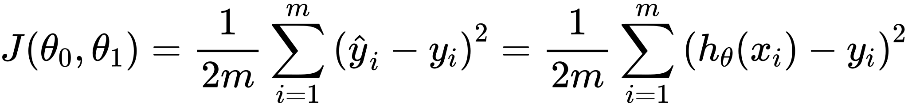

# Cost Function

We can measure the accuracy of our hypothesis function by using a cost function. This takes an average difference (actually a fancier version of an average) of all the results of the hypothesis with inputs from x's and the actual output y's.

<!-- $
J(\theta_0, \theta_1) = \dfrac {1}{2m} \displaystyle \sum _{i=1}^m \left ( \hat{y}_{i}- y_{i} \right)^2 = \dfrac {1}{2m} \displaystyle \sum _{i=1}^m \left (h_\theta (x_{i}) - y_{i} \right)^2
$ --> 

This function is otherwise called the "`Squared error function`", or "`Mean squared error`". The mean is halved 1/2 as a convenience for the computation of the gradient descent, as the derivative term of the square function will cancel out the 1/2 term. The following image summarizes what the cost function does:

